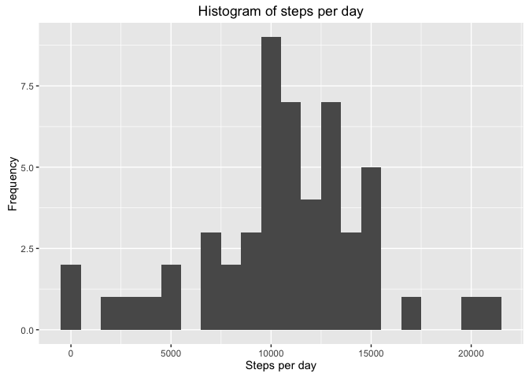
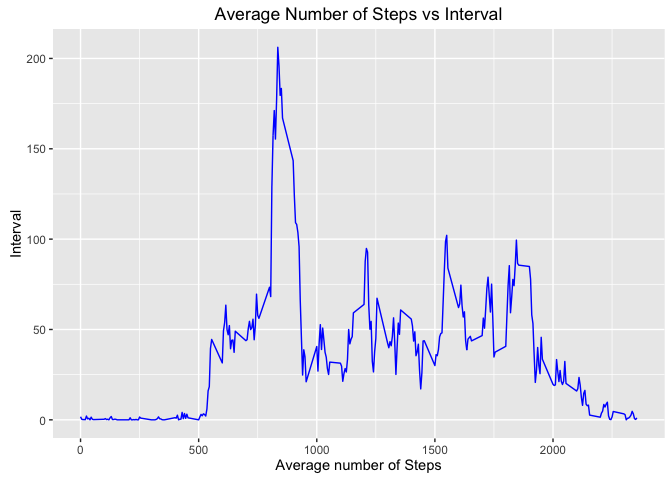
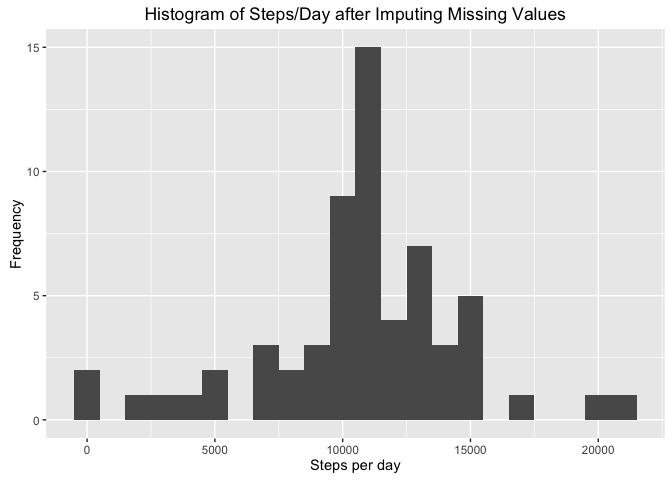

# Reproducible Research: Peer Assessment 1


## Introduction

It is now possible to collect a large amount of data about personal
movement using activity monitoring devices such as a
[Fitbit](http://www.fitbit.com), [Nike
Fuelband](http://www.nike.com/us/en_us/c/nikeplus-fuelband), or
[Jawbone Up](https://jawbone.com/up). These type of devices are part of
the "quantified self" movement -- a group of enthusiasts who take
measurements about themselves regularly to improve their health, to
find patterns in their behavior, or because they are tech geeks. But
these data remain under-utilized both because the raw data are hard to
obtain and there is a lack of statistical methods and software for
processing and interpreting the data.

This assignment makes use of data from a personal activity monitoring
device. This device collects data at 5 minute intervals through out the
day. The data consists of two months of data from an anonymous
individual collected during the months of October and November, 2012
and include the number of steps taken in 5 minute intervals each day.

## Data

The Data for this assignment was taken from the Original GitHub repository (http://github.com/rdpeng/RepData_PeerAssessment1).

## Loading the necessary packages for this assignment

```r
library(knitr)
library(dplyr)
```

```
## 
## Attaching package: 'dplyr'
```

```
## The following objects are masked from 'package:stats':
## 
##     filter, lag
```

```
## The following objects are masked from 'package:base':
## 
##     intersect, setdiff, setequal, union
```

```r
library(lubridate)
```

```
## Warning: package 'lubridate' was built under R version 3.2.4
```

```
## 
## Attaching package: 'lubridate'
```

```
## The following object is masked from 'package:base':
## 
##     date
```

```r
library(ggplot2)
```

```
## Warning: package 'ggplot2' was built under R version 3.2.4
```

## Loading and preprocessing the data

The data file is first unzipped and the activity data is read.

```r
unzip("activity.zip")
activitydata <- read.csv("activity.csv")
```

We look at the data to get an idea.

```r
head(activitydata)
```

```
##   steps       date interval
## 1    NA 2012-10-01        0
## 2    NA 2012-10-01        5
## 3    NA 2012-10-01       10
## 4    NA 2012-10-01       15
## 5    NA 2012-10-01       20
## 6    NA 2012-10-01       25
```

```r
tail(activitydata)
```

```
##       steps       date interval
## 17563    NA 2012-11-30     2330
## 17564    NA 2012-11-30     2335
## 17565    NA 2012-11-30     2340
## 17566    NA 2012-11-30     2345
## 17567    NA 2012-11-30     2350
## 17568    NA 2012-11-30     2355
```

```r
class(activitydata)
```

```
## [1] "data.frame"
```

```r
names(activitydata)
```

```
## [1] "steps"    "date"     "interval"
```

```r
dim(activitydata)
```

```
## [1] 17568     3
```

```r
str(activitydata)
```

```
## 'data.frame':	17568 obs. of  3 variables:
##  $ steps   : int  NA NA NA NA NA NA NA NA NA NA ...
##  $ date    : Factor w/ 61 levels "2012-10-01","2012-10-02",..: 1 1 1 1 1 1 1 1 1 1 ...
##  $ interval: int  0 5 10 15 20 25 30 35 40 45 ...
```

```r
summary(activitydata)
```

```
##      steps                date          interval     
##  Min.   :  0.00   2012-10-01:  288   Min.   :   0.0  
##  1st Qu.:  0.00   2012-10-02:  288   1st Qu.: 588.8  
##  Median :  0.00   2012-10-03:  288   Median :1177.5  
##  Mean   : 37.38   2012-10-04:  288   Mean   :1177.5  
##  3rd Qu.: 12.00   2012-10-05:  288   3rd Qu.:1766.2  
##  Max.   :806.00   2012-10-06:  288   Max.   :2355.0  
##  NA's   :2304     (Other)   :15840
```

## Cleaning the data

Change the date class from 'factor' to 'date' format using the lubridate package.

```r
activitydata$date <- ymd(activitydata$date)
str(activitydata)
```

```
## 'data.frame':	17568 obs. of  3 variables:
##  $ steps   : int  NA NA NA NA NA NA NA NA NA NA ...
##  $ date    : Date, format: "2012-10-01" "2012-10-01" ...
##  $ interval: int  0 5 10 15 20 25 30 35 40 45 ...
```

Check to see if there are any 'NA' entries  in the data

```r
sum(is.na(activitydata$steps))
```

```
## [1] 2304
```

```r
sum(is.na(activitydata$date))
```

```
## [1] 0
```

```r
sum(is.na(activitydata$interval))
```

```
## [1] 0
```

Create a new dataset removing all the 'NA' entries

```r
cleanactivitydata <- activitydata[!is.na(activitydata$step), ]
```

Check to see if all the 'NA' entries from 'steps' have been removed from the new dataset.

```r
str(cleanactivitydata)
```

```
## 'data.frame':	15264 obs. of  3 variables:
##  $ steps   : int  0 0 0 0 0 0 0 0 0 0 ...
##  $ date    : Date, format: "2012-10-02" "2012-10-02" ...
##  $ interval: int  0 5 10 15 20 25 30 35 40 45 ...
```

```r
sum(is.na(cleanactivitydata$steps))
```

```
## [1] 0
```


## What is mean total number of steps taken per day?
For this part of the Assignment the cleaned data was used.

#### 1. Calculate the total number of steps taken per day

```r
stepsperday <- cleanactivitydata %>%
        group_by(date) %>%
        summarize(stepsperday = sum(steps)) %>%
        print
```

```
## Source: local data frame [53 x 2]
## 
##          date stepsperday
##        (date)       (int)
## 1  2012-10-02         126
## 2  2012-10-03       11352
## 3  2012-10-04       12116
## 4  2012-10-05       13294
## 5  2012-10-06       15420
## 6  2012-10-07       11015
## 7  2012-10-09       12811
## 8  2012-10-10        9900
## 9  2012-10-11       10304
## 10 2012-10-12       17382
## ..        ...         ...
```

#### 2. Make a histogram of the total number of steps taken each day.

```r
ggplot(stepsperday, aes(x = stepsperday)) +
        geom_histogram(binwidth = 1000) +
        labs(title = "Histogram of steps per day", x = "Steps per day", y = "Frequency")
```

<!-- -->

#### 3. Calculate and report the mean and median of the total number of steps taken per day.

```r
mean(stepsperday$stepsperday)
```

```
## [1] 10766.19
```

```r
median(stepsperday$stepsperday)
```

```
## [1] 10765
```

## What is the average daily activity pattern?

#### 1. Make a time series plot (i.e. type ="l") of the 5-minute interval (x-axis) and the average number of steps taken, averaged across all days (y-axis)

Calculate the average number of steps steps taken in each interval.

```r
avgstepsperinterval <- cleanactivitydata %>%
        group_by(interval) %>%
        summarize(avgsteps = mean(steps)) %>%
        print
```

Plot the time series plot using ggplot

```r
ggplot(avgstepsperinterval, aes(x = interval, y = avgsteps)) +
        geom_line(color = "blue") +
        labs(title = "Average Number of Steps vs Interval", x = "Average number of Steps", y = "Interval")
```

<!-- -->

#### 2. Which 5-minute interval, on average across all the days in the dataset, contains the maximum number of steps?

Find the interval with the maximum average steps.

```r
avgstepsperinterval[which.max(avgstepsperinterval$avgsteps), ]
```

```
## Source: local data frame [1 x 2]
## 
##   interval avgsteps
##      (int)    (dbl)
## 1      835 206.1698
```

## Imputing missing values
For this part of the Assignment the original data with the missing values (NA) was used. 

#### 1. Calculate and report the number of missing values in the dataset (i.e. the number of rows with NAs)

```r
sum(is.na(activitydata$steps))
```

```
## [1] 2304
```

#### 2. Devise a strategy for filling in all of the missing values in the dataset.

The average number of steps in the same 5-min interval will be used to fill in the missing values.

```r
activitydatacopy <- activitydata
avgper5minintvl <- tapply(activitydatacopy$steps, activitydatacopy$interval, mean, na.rm = TRUE, simplify = TRUE)
```

#### 3. Create a new dataset that is equal to the original dataset but with the missing data filled in.


```r
missingvalues <- is.na(activitydatacopy$steps)
activitydatacopy$steps[missingvalues] <- avgper5minintvl[as.character(activitydatacopy$interval[missingvalues])]
```

Check to see if the new data set has any missing values (NA)

```r
sum(is.na(activitydatacopy$steps))
```

```
## [1] 0
```

#### 4. Make a histogram of the total number of steps taken each day and Calculate and repot the 'mean' and 'median' total number of steps taken per day. Do these values differ from the estimates from the first part of the assignment? What is the impact of imputing missing data on the estimates of the total daily number of steps.

Calculate the total number of steps taken each day

```r
stepsperday_rNA <- activitydatacopy %>%
        group_by(date) %>%
        summarize(totalsteps = sum(steps)) %>%
        print
```

```
## Source: local data frame [61 x 2]
## 
##          date totalsteps
##        (date)      (dbl)
## 1  2012-10-01   10766.19
## 2  2012-10-02     126.00
## 3  2012-10-03   11352.00
## 4  2012-10-04   12116.00
## 5  2012-10-05   13294.00
## 6  2012-10-06   15420.00
## 7  2012-10-07   11015.00
## 8  2012-10-08   10766.19
## 9  2012-10-09   12811.00
## 10 2012-10-10    9900.00
## ..        ...        ...
```

Plot histogram of the total number of steps taken per day using ggplot

```r
ggplot(stepsperday_rNA, aes(x = totalsteps)) +
        geom_histogram(binwidth = 1000) +
        labs(title = "Histogram of Steps/Day after Imputing Missing Values", x = "Steps per day", y = "Frequency")
```

<!-- -->

Calculate the 'mean' and 'median' after imputing the missing values.

```r
mean(stepsperday_rNA$totalsteps)
```

```
## [1] 10766.19
```

```r
median(stepsperday_rNA$totalsteps)
```

```
## [1] 10766.19
```

After Imputing the missing values the 'mean' and 'median' total number of steps taken per day are both equal to 10766.


## Are there differences in activity patterns between weekdays and weekends?

#### 1. Create a new factor variable in the dataset with two levels - "weekday" and "weekend" indicating whether a given date is a weekday or weekend day.

Create a new column in the dataset called 'daytype' with two levels "weekday" and "weekend"

```r
activitydatacopy <- mutate(activitydatacopy, daytype = ifelse(weekdays(activitydatacopy$date) == "Saturday" | weekdays(activitydatacopy$date) == "Sunday", "weekend", "weekday"))

head(activitydatacopy)
```

```
##       steps       date interval daytype
## 1 1.7169811 2012-10-01        0 weekday
## 2 0.3396226 2012-10-01        5 weekday
## 3 0.1320755 2012-10-01       10 weekday
## 4 0.1509434 2012-10-01       15 weekday
## 5 0.0754717 2012-10-01       20 weekday
## 6 2.0943396 2012-10-01       25 weekday
```

```r
tail(activitydatacopy)
```

```
##           steps       date interval daytype
## 17563 2.6037736 2012-11-30     2330 weekday
## 17564 4.6981132 2012-11-30     2335 weekday
## 17565 3.3018868 2012-11-30     2340 weekday
## 17566 0.6415094 2012-11-30     2345 weekday
## 17567 0.2264151 2012-11-30     2350 weekday
## 17568 1.0754717 2012-11-30     2355 weekday
```

```r
levels(factor(activitydatacopy$daytype))
```

```
## [1] "weekday" "weekend"
```

#### 2. Make a panel plot containing a time series plot (i.e. type = "l") of the 5-minute interval (x-axis) and the average number of steps taken, averaged across all the weekdays or weekend days (y-axis).

Calculate the average steps taken per day in each 5-minute interval across all the weekdays and weekends.

```r
avgper5minintvl_daytype <- activitydatacopy %>%
        group_by(interval, daytype) %>%
        summarize(avgstepsInt = mean(steps)) %>%
        print
```

```
## Source: local data frame [576 x 3]
## Groups: interval [?]
## 
##    interval daytype avgstepsInt
##       (int)   (chr)       (dbl)
## 1         0 weekday 2.251153040
## 2         0 weekend 0.214622642
## 3         5 weekday 0.445283019
## 4         5 weekend 0.042452830
## 5        10 weekday 0.173165618
## 6        10 weekend 0.016509434
## 7        15 weekday 0.197903564
## 8        15 weekend 0.018867925
## 9        20 weekday 0.098951782
## 10       20 weekend 0.009433962
## ..      ...     ...         ...
```

Plot the time series plot using ggplot.

```r
ggplot(avgper5minintvl_daytype, aes(x = interval, y = avgstepsInt, color = daytype)) +
        geom_line() +
        labs(title = "Average Daily Steps per Interval", x = "Interval", y = "Average Steps") +
        facet_wrap(~daytype, ncol = 1, nrow = 2)
```

<!-- -->
